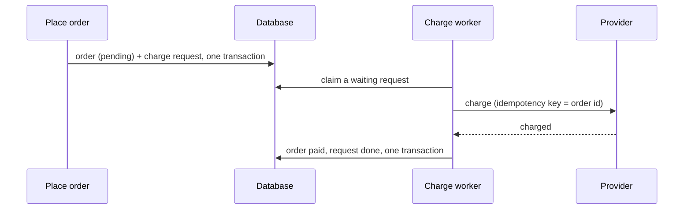
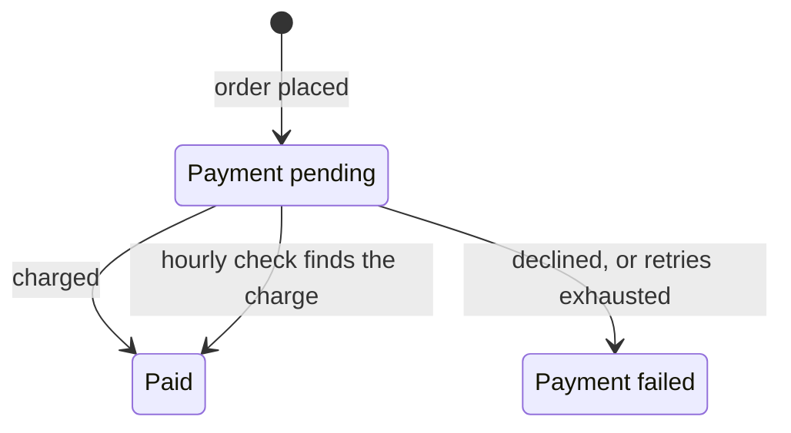

# Design documents

> **A design document is the smallest document that lets another engineer understand, challenge and approve the
> proposed change.**

Before an agent builds something non-trivial, it writes the design and opens it in Co-Review. You comment on the
steps, diagrams and text you disagree with, the agent answers and revises, and it implements only what you approved.

The document is for **review**, not for future readers. It should show the decisions, assumptions, trade-offs,
important behaviour, failure modes and open questions, so a reviewer can answer *"is this the right approach?"*
without reading the implementation. A trivial change should never need a 100-line document.

In short: **investigate the code, understand the problem, make the smallest reasonable design, show the decisions
that need review, keep it short unless the complexity demands more, get approval, then implement it.**

## When to write one

Write a design when a reviewer should agree on the approach before code exists: a new component, a data model or API
change, a new asynchronous flow, a migration, or anything whose failure handling isn't obvious. For a local change
that follows an existing pattern, skip the design, or keep it to a few lines.

## The template

```markdown
---
co-review: design
---
# <Title>

## Context
Why are we changing this? What exists today? Only what's needed to understand the change.

## Design
- <L1: a responsibility or behaviour that matters from outside>
  - <L2: how it is achieved>
    - <L3: an edge case, failure mode or constraint that matters>

## Alternatives
Optional. Only when there is a real choice a reviewer may want to challenge.

## Behaviour
Optional. Runtime scenarios that aren't obvious from the Design.

## Open Questions
Optional. Unresolved decisions that need the reviewer.
```

**Context** is almost always useful. **Design** is the document. The other sections are **optional**: leave them out
unless they help the review. There are no other sections. Anything else (a migration, a compatibility constraint, a
security boundary) goes where it matters, usually as a step in the Design.

### What goes where

| Section | Required | Put here | Leave out |
|---|---|---|---|
| `# ` title | yes | the change, as a short imperative ("Retry outbound webhooks") | the ticket number, "Design for…" |
| Context | usually | the problem, what happens today, why it must change | a system overview, the solution |
| Design | **yes** | the steps: what (L1), how (L2), what can go wrong (L3) | code, obvious implementation details |
| Alternatives | no | real choices, their trade-offs, why this one | options invented to fill the section |
| Behaviour | no | runtime scenarios: failure, retry, crash, race | a replay of the Design |
| Open Questions | no | decisions only the reviewer can make | things the agent can look up |

### Written for a person

A person reads the document to judge the approach, so it reads like an explanation, not like code:

- **Plain language.** Describe what the code does in words.
- **Name code once, at the top level.** Name the entry point, module or new table a step is about the first time it
  appears, then refer to it in words ("the job runner", "the charge request"). Don't repeat function names from step
  to step.
- **No line numbers** and no `file:line` links. They belong in review threads, not in a design.
- **No pasted code.** Mermaid diagrams are welcome. The code belongs in the implementation.
- **One decision per step**, a line or two long. Put details in child steps.

### Size follows complexity

| Change | Typical size | For example |
|---|---|---|
| Small | 10–30 lines | a local behaviour change, a small API change, a new component that follows an existing pattern |
| Medium | 30–80 lines | several components, API or data changes, new asynchronous behaviour, real failure handling |
| Large | 80–150 lines | cross-system changes, a new data model, migrations, new infrastructure, concurrency or consistency concerns |
| Exceptional | no hard limit | length must be justified by actual complexity |

These are guidelines, not targets. **Complexity justifies length, not the other way around.** Never pad a document
to look thorough. **Concise doesn't mean incomplete**, though: never drop a decision or a failure mode just to keep
it short.

## The sections

### Context

The minimum a reviewer needs to understand why the change exists and which part of the system it touches:

- What problem are we solving?
- What happens today?
- Why does it need to change?

Write a few concrete sentences or bullets. It's not a system overview: leave out unrelated architecture, and don't
repeat what the Design says.

### Design

The Design is one nested list, and each item is a step a reviewer can comment on. The level of a step says what kind
of statement it is:

| Level | Answers | Contains |
|---|---|---|
| **L1: what** | What does this part of the system need to do? | a responsibility, a behaviour, a boundary, an outcome |
| **L2: how** | How is that achieved? | components, data flow, APIs, persistence, queues, algorithms, state transitions, the existing pattern it reuses |
| **L3: what can go wrong** | What could break correctness? | failure modes, retries, concurrency, consistency, edge cases, security, compatibility, recovery |

Not every step needs children. Add an L3 only when the detail matters.

**Keep the what separate from the how.** State the behaviour first, then the mechanism. Prefer

```markdown
- Deliver each accepted webhook at least once
  - Persist the delivery before publishing the delivery event
  - Process delivery events asynchronously
    - Retry transient failures with exponential backoff
    - Do not retry permanent HTTP failures
```

over

```markdown
- Use Kafka to send webhooks
  - Create a Kafka consumer
    - Handle errors
```

The first shows a decision (at-least-once delivery) and how it's met. The second makes a technology the design and
hides the decisions a reviewer needs to check.

### Alternatives (optional)

Include this section only when there is a real architectural choice a reviewer might reasonably challenge. For each
alternative, say what it is and its trade-off, then why the proposed approach won:

```markdown
## Alternatives

### Direct HTTP delivery
Simpler, but request latency and destination availability become coupled.

### Queue-based delivery
Adds infrastructure but allows retries and decouples producers from destination availability.

Selected because delivery can be delayed and retried independently.
```

If the choice is obvious, leave the section out. Never write "Option A / Option B" just to fill the section.

### Behaviour (optional)

Runtime scenarios that make the design easier to reason about: the happy path, failures, retries, partial failure,
concurrency, timeouts, duplicates, recovery. Don't restate the Design.

```markdown
## Behaviour

### Destination unavailable
Request → persist → enqueue → worker → 503 → retry later

### Worker crashes after a successful delivery
Destination receives the request → worker crashes before recording it → the delivery is sent again
```

Mermaid diagrams (a sequence or a state diagram) work well here. They can also go in Context or Alternatives, or in
their own `## Diagrams` section.

### Open Questions (optional)

Only questions that are genuinely unresolved, matter to the design, and need a reviewer's decision. Nothing the agent
could find out from the repository, and nothing it's merely unsure about.

```markdown
- Should delivery order be guaranteed per destination?
```

Not "What should we call the service?", "Should we add more logging?" or "Is this good?".

## How an agent writes a design

```text
Investigate → understand the existing system → identify the actual problem → identify the decisions
→ choose the simplest design that works → write it concisely → self-review → open for review
→ revise from comments → approval → implement → check the code against the design
```

### 1. Investigate before designing

Don't start writing a solution. First read the code the change touches: the relevant source, existing abstractions,
APIs, data models, tests, infrastructure, event flows and dependencies. Most of a good design comes from seeing how
the system already solves similar problems.

**Prefer what exists.** Don't introduce a new abstraction, dependency, service, store, protocol or piece of
infrastructure when an existing pattern in the repository solves the problem. If something new really is needed,
make that an explicit step in the Design, so the reviewer can challenge it.

### 2. Don't invent requirements

Don't invent requirements, constraints, traffic numbers, SLAs, guarantees or business rules that the repository, the
task or the reviewer doesn't support. If missing information would change the design, say so in Open Questions
instead of silently picking an answer.

### 3. Choose the simplest design that works

Prefer existing infrastructure, data stores, messaging and abstractions; simple control flow; fewer moving parts,
dependencies and services.

- Don't solve hypothetical future requirements unless they affect the current design.
- Don't add scalability, configurability, extensibility or abstraction because it might be useful later.

### 4. Think widely, write narrowly

Consider everything that could matter: functional and non-functional requirements, invariants, compatibility,
security, performance, observability, migration, testing, rollout and failure handling. These are **questions to
ask yourself, not sections to write**. For each one, ask: *does this materially affect the design?* If it does, put
it where it belongs, usually as a Design step. If it doesn't, leave it out.

Deep reasoning, concise document. Not shallow reasoning with a short document to show for it.

### 5. Write concretely

Every step should state a decision or a behaviour.

| Write | Not |
|---|---|
| Persist the delivery before publishing the event. | The system should ensure reliable persistence and event processing. |
| Retry 5xx responses with exponential backoff. | The system should handle transient failures appropriately. |
| Use the existing pharmacy availability resolver. | Create a reusable mechanism for resolving availability. |

Don't repeat the task description, explain obvious implementation details, or write prose where a step will do.

### 6. Self-review before opening

- Is the problem clear, with just enough context?
- Is the proposed solution clear, and are the important decisions visible?
- Is the what (L1) separate from the how (L2)?
- Are the failure modes and edge cases that matter covered (L3)?
- Are real trade-offs visible, and are data, API and compatibility effects covered where they matter?
- Were existing patterns in the repository used or considered?
- Is anything more complex than it needs to be?
- Are the Open Questions genuinely unresolved and worth a reviewer's decision?
- Can a person follow it without opening the code: plain language, code named once, no line numbers?
- Is the size right for the complexity?

Then **remove anything that doesn't help a reviewer understand the change or make a decision.**

## Review

The agent opens the document with `open_review({ dir })` and gives you the link. You comment on any step, a diagram,
a single diagram node or edge, or a piece of text, and the agent answers in the thread.

When a comment arrives, the agent:

1. Reads it in context and checks the code if needed.
2. Decides what it points at: missing information, a wrong assumption, an architectural problem, an unresolved
   decision, or a detail that doesn't belong in the design.
3. Updates the document and replies in the thread with what changed.
4. Doesn't accept every suggestion blindly: if a suggestion conflicts with what the code shows, it says so, with the
   evidence.

The rounds continue until you approve. A design that merely looks plausible isn't approved: your approval means you
agree with the architecture.

### Keep comments attached

Comments are anchored to the text they're about (see [Anchors](#anchors)), so a revision shouldn't lose them:

- Keep the wording of commented steps stable where practical. Moving a step doesn't outdate its comments, but
  rewording it does.
- When a step has to change substantially, prefer adding or restructuring steps around it over rewriting it.
- Correctness comes first: if a step is wrong, fix it, even if its comment becomes outdated.

## Approval and implementation

After approval, the agent implements the approved design and doesn't quietly change the architecture along the way.
When it finishes, it checks the code against the design.

If implementation shows that the design is wrong or incomplete, the agent:

1. stops the affected work;
2. updates the design;
3. sends the change through review again;
4. continues only after you approve the change.

A small detail that doesn't change a decision doesn't need another round. The document never describes something
that wasn't built.

## Examples

The structure adapts to the change: each example includes only the sections it needs, and names code only where it
helps the reader find it.

### Small: rate-limit password-reset emails (about 15 lines)

No Alternatives, Behaviour, testing or rollout section: none of them would help the review.

```markdown
---
co-review: design
---
# Rate-limit password-reset emails

## Context
The password-reset endpoint sends an email on every request, so anyone can flood an inbox. Login attempts are
already limited by the shared rate limiter (`RateLimiter`, Redis, per key).

## Design
- Send at most 3 reset emails per account per hour
  - Reuse the shared rate limiter, keyed by account
    - Still answer "accepted" when limited, so the endpoint doesn't reveal whether an account exists
- Count limited requests in the existing auth rate-limit metric
```

### Medium: retry outbound webhooks (about 45 lines)

It has Alternatives, because there's a real choice to make, and Behaviour, because the failure cases are the point
of the change.

````markdown
---
co-review: design
---
# Retry outbound webhooks

## Context
Webhooks are sent inside the API request (`WebhookSender`). When a customer's endpoint is down, the event is lost
and the request slows down; about 2% of deliveries fail today. The service already runs durable background jobs on
Postgres (`JobRunner`).

## Design
- Deliver each accepted webhook at least once
  - Record the delivery and queue a delivery job in the request's transaction
  - The job sends the event and marks the delivery done
    - A crash can repeat a delivery, so every event carries a stable id that receivers can deduplicate on
- Retry failures that can succeed later
  - Retry timeouts, rate limiting and server errors with exponential backoff, for up to 24 hours
  - Fail other client errors at once, without retrying
    - When rate limited, wait as long as the endpoint asks
- Show customers what happened
  - List each event's attempts and final status in the existing webhook log

## Alternatives

### Keep sending inline and retry in the request
No new jobs, but a slow endpoint still slows the API, and retries can't span hours.

### A dedicated message broker
Adds infrastructure; the existing job runner already gives durable, scheduled retries.

Selected: the existing job runner, because retries must be durable and delayed, and it's already in place.

## Behaviour

### Endpoint down for an hour
Request → delivery and job saved → failures, retried with backoff → success → delivered

### Worker crashes after the endpoint accepted the event
Endpoint gets the event → worker dies before marking it done → the job runs again → the endpoint gets it again,
with the same event id

## Open Questions
- After 24 hours of failures, should we stop delivering to that endpoint, or keep retrying new events?
````

### Large: charge customers through an outbox (about 90 lines)

This change is longer because of the migration, the concurrency and the compatibility constraints, not because of
the template.

````markdown
---
co-review: design
---
# Charge customers through an outbox

## Context
Placing an order (`CreateOrder`) charges the customer through the payment provider inside the database
transaction. The transaction holds row locks for the whole payment call (p99 1.8 s), and a provider timeout rolls
back an order the customer may already have paid for. Support resolves about 20 such cases a week by hand.

Customers must be charged exactly once. The mobile app polls the order and shows "processing" for any status other
than paid or failed.

## Design
- Accept the order without waiting for the payment provider
  - Save the order as "payment pending" together with a charge request, in one transaction
    — `✎` new `payment_outbox` table for charge requests
  - Respond at once with the pending status
    - Older app versions show "processing" for statuses they don't know, so they keep working
- Charge each order exactly once
  - A background worker claims waiting charge requests, oldest first, skipping rows another worker holds
    - Several workers can run; each request is claimed by one worker at a time
  - Charge through the provider with the order id as the idempotency key
    - Repeating the call after a crash returns the original charge, so the customer is never charged twice
  - Save the result and move the order to paid or failed in one transaction
- Retry what can succeed later
  - Retry timeouts and provider errors with backoff, for up to 1 hour
    — `⚠` the provider forgets idempotency keys after 24 hours; retries must stop well before that
  - Fail the order on a card decline and send the existing "payment failed" email
- Switch traffic over gradually
  - Put the new path behind a feature flag, per region
  - Keep the current inline path until the flag is on everywhere, then delete it
    - Orders placed through the inline path have no charge request, so the worker never sees them
- Make stuck payments visible
  - Alert when the oldest waiting charge request is older than 10 minutes, as the email outbox already does
- Settle orders whose outcome is unknown
  - Every hour, ask the provider about orders still pending after an hour, by idempotency key
    - Charged: mark paid. Not found: mark failed. Provider unreachable: ask again next hour

## Alternatives

### Keep charging inline, with a shorter timeout
Smaller change, but it still holds locks during a network call, and a timeout still leaves the payment state
unknown.

### Publish an event and charge from a consumer
No new table, but saving the order and publishing the event can't be atomic without an outbox anyway.

Selected: a database outbox, the same pattern as the email outbox, with no new infrastructure.

## Behaviour





### Two workers poll at the same time
Each claims different charge requests, so no order is charged by both

### Worker crashes after the provider charged the card
The request stays waiting → another worker claims it → the provider returns the original charge for the same key →
the order becomes paid, and the customer is charged once

### Provider down for 30 minutes
Requests back up and the alert fires after 10 minutes → retries succeed once the provider recovers → the orders
become paid

## Open Questions
- Should a failed order release its reserved inventory at once, or after a grace period for the customer to retry?
````

## Format reference

The rules Co-Review uses to render and check a design document. The implementation is in
[`design-format.ts`](../extensions/review/src/common/design-format.ts) (sections, step tree, checks) and
[`document-render.ts`](../extensions/review/src/browser/document/document-render.ts) (rendering).

### Declaring the format

Start the document with frontmatter. `title` is optional; without it, the `# ` heading is used.

```markdown
---
co-review: design
title: Charge customers through an outbox
---
```

`co-review: design` makes Co-Review render the step tree and check the document. Problems are shown to the reviewer
as a banner, and the agent gets the same list in `format.warnings` (from `open_review`) and `doc.format` (from
`await_review` and `get_review`).

| Document | Rendered as |
|---|---|
| `co-review: design` frontmatter | Design, checked |
| `*.pseudocode.md`, or a `## Design` section | Design, not checked (the agent is told to add the frontmatter) |
| Anything else | Plain Markdown with Mermaid |
| `co-review: <something else>` | Plain Markdown, with a warning |

Nothing is dropped: an unknown section renders as Markdown, with a warning.

### Sections

| Section | Required | Rendered as |
|---|---|---|
| `# ` title | yes (or `title:` in the frontmatter) | Page title |
| `## Context` | no | Markdown and Mermaid |
| `## Design` | **yes** | Step tree |
| `## Alternatives` | no | Markdown and Mermaid |
| `## Behaviour` (or `Behavior`) | no | Markdown and Mermaid |
| `## Diagrams` | no | Markdown and Mermaid |
| `## Open Questions` | no | Step tree, so each question can take a comment |

Sections that are present must appear in this order.

### The step tree

- `## Design` is **one nested `- ` list**. Items marked with `*`, `+` or `1.` don't become steps.
- Nesting comes from indentation: 2 spaces per level (a tab counts as 4). The depth is the level (L1, L2, L3), and the
  L1 / L2 / L3 buttons fold the tree to that depth.
- A line without `- ` continues the step above it.
- Text after ` — ` (space, em dash, space) is shown muted. Use it for a short reason when the step alone doesn't say
  why, not on every step.
- Optional markers, in backticks inside a step: `` `?` `` open question, `` `⚠` `` risk, `` `✎` `` new name or
  artifact (a table, a module, a type). `` `code` ``, `**bold**` and `*italic*` work as usual.

### Anchors

| Commented on | Anchored by |
|---|---|
| A step | Its text with backticks and asterisks removed, whitespace collapsed, first 80 characters |
| A diagram | Its block id: `%% id: <name>` as the first line of the Mermaid block |
| A diagram node or edge | The block id plus the node id (`req[Ingest request]` has id `req`) |
| Text | The quoted text and the words around it |

So keep commented steps' wording stable, give every Mermaid block `%% id:`, and give nodes explicit ids.

### The quick check

When the agent opens a declared design document, Co-Review checks it and returns problems in `format.warnings`. The
reviewer sees the same list as a banner, so the agent fixes them and opens the document again before sharing it.

| Check | Warns about |
|---|---|
| Structure | no title; no `## Design`, or no `- ` steps in it; sections outside the contract, or out of order |
| Line references | `file.ext:42` or `#L42` anywhere outside code blocks |
| Pasted code | fenced code blocks other than Mermaid |
| Long steps | steps longer than about two lines (220 characters) |
| Repeated code names | the same `` `name` `` in 3 or more steps |

## The agent prompt

Every agent gets the same instructions: the `co-review-design` skill (Claude Code, Pi, Oh My Pi), the `open_review`
tool description (any MCP agent) and [`llms.txt`](../llms.txt) all say this. Start it with `/co-review:design <task>`
in Claude Code or `/co-review-design <task>` in Pi and Oh My Pi. For any other agent, give it this prompt:

```text
Before implementing <task>, write a design for me to review in Co-Review.

1. Investigate the code first. Reuse existing patterns. Don't invent requirements: ask under Open Questions.
2. Write design/<name>/index.markdown, for a person to read:
   ---
   co-review: design
   ---
   # <the change, as a short imperative>
   ## Context         why change, what happens today (a few sentences)
   ## Design          required: one nested "- " list, 2 spaces per level
                      L1 what (a behaviour, not a technology), L2 how, L3 what can go wrong
   ## Alternatives    optional: real choices, their trade-offs, why this one
   ## Behaviour       optional: runtime scenarios (failure, retry, crash, race)
   ## Open Questions  optional: decisions only I can make, as "- " items
   Plain language, one decision per step. Name code once, at the top level (entry point, module, new table),
   then describe it in words. No line numbers, no file:line links, no pasted code (Mermaid is fine).
   Size it to the change: about 10-30 lines if small, 30-80 medium, 80-150 large.
3. Open it with open_review({ dir }). Fix every format.warnings item and open it again, then give me the URL.
4. Answer my comments in their threads and revise the design; keep the wording of commented steps stable.
5. Implement only after I approve. If the code must depart from the approved design, update it and ask again.
```
