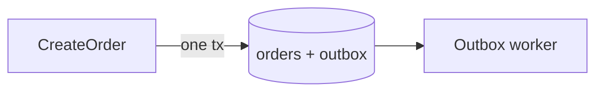

# Design documents

A design document is Markdown that Co-Review renders as a reviewable design. It can include prose sections, Mermaid diagrams, and a foldable step tree (L1, L2, L3), where every step, diagram node, and piece of text can carry a comment thread.

This page is the specification. The implementation lives in two files:

- [`design-format.ts`](../extensions/review/src/common/design-format.ts) — sections, step tree, and checks.
- [`document-render.ts`](../extensions/review/src/browser/document/document-render.ts) — markers and rendering.

## Declaring the format

Start the document with frontmatter that declares the design format:

```markdown
---
co-review: design
title: Charge customers through an outbox
---
```

The `title` field is optional; otherwise the `# ` heading is used.

`co-review: design` tells Co-Review to render the step tree and **check the document** against this specification. Anything that doesn't match is shown to the reviewer as a banner. The agent gets the same list in `format.warnings` (from `open_review`) and in `doc.format` (from `await_review` and `get_review`).

### Documents without the declaration

Documents without frontmatter are still rendered. Co-Review picks the mode automatically:

| Document | Rendered as |
|---|---|
| `co-review: design` frontmatter | Design, checked against this specification |
| `*.pseudocode.md`, or a `## Design` section | Design, not checked (the agent is told to add the frontmatter) |
| Anything else | Plain Markdown with Mermaid |
| `co-review: <something else>` | Plain Markdown, with a warning |

No mode drops content: sections outside the specification render as Markdown.

## Structure

A design document has four sections, in this order. Other `##` sections are allowed; they render as Markdown and are reported as outside the specification.

```markdown
---
co-review: design
---
# <Title>

## Context
Why this change, constraints, links.
Markdown and Mermaid.

## Design
- <L1 step: what happens, in business language> — <why>
  - <L2 step: how> — `⚠` <risk>
    - <L3 step: edge case or error path> — `?` <open question>
- <another L1 step> — `✎` new `<Name>`

## Diagrams
Mermaid blocks, with prose around them if needed.

## Open Questions
- <question> — `?` <who decides, or what is missing>
```

| Section | Required | Rendered as |
|---|---|---|
| `# ` title | yes (or `title:` in the frontmatter) | Page title |
| `## Context` | no | Markdown |
| `## Design` | **yes** | Step tree |
| `## Diagrams` | no | Markdown and Mermaid |
| `## Open Questions` | no | Step tree |

## The step tree

The `## Design` section is **one nested `- ` list**. Items marked with `*`, `+` or `1.` don't become steps.

### Nesting and depth

Nesting comes from indentation: 2 spaces per level (a tab counts as 4). The depth determines the level:

- **L1** — what happens, in business language.
- **L2** — how.
- **L3** — edge cases and error paths.

The L1 / L2 / L3 buttons fold the tree to that depth.

### Writing steps

- One idea per step, starting with a verb.
- A line without `- ` continues the step above it.
- Text after ` — ` (space, em dash, space) is the reasoning and is shown muted.

### Inline markers

Put these in backticks inside a step:

| Marker | Meaning |
|---|---|
| `` `?` `` | Open question |
| `` `⚠` `` | Risk |
| `` `✎` `` | New name or artifact (a table, a module, a type) |

Standard inline formatting works inside steps: `` `code` ``, `**bold**`, and `*italic*`.

## Anchors: keep comments attached

Comments are anchored to what they are about, so revisions don't lose them.

| Commented on | Anchored by |
|---|---|
| A step | Its text with backticks and asterisks removed, whitespace collapsed, first 80 characters |
| A diagram | Its block id: `%% id: <name>` as the first line of the Mermaid block |
| A diagram node / edge | Block id plus node id (`req[Ingest request]` has id `req`) |
| Text | The quoted text and its surrounding words |

Two guidelines follow from this:

- **Keep step wording stable.** Rewording a step outdates its comments; moving it within the tree doesn't. Add new steps rather than rewriting commented ones.
- **Give every Mermaid block `%% id:` and every node an explicit id.**

## Example

````markdown
---
co-review: design
---
# Charge customers through an outbox

## Context
`CreateOrder` charges the customer inside the database transaction,
holding row locks for the whole payment call.

## Design
- Save the order and a charge request together
  — one transaction, no network calls inside it
  - insert a `charge_requested` outbox row keyed by order id
    — `✎` new `payment_outbox` table
- Charge from a background worker
  — at-least-once, safe to retry
  - poll unsent outbox rows, oldest first
    — `?` polling or LISTEN/NOTIFY
  - mark the row sent, or schedule a retry with backoff
    — `⚠` a charge can succeed while the mark fails

## Diagrams


## Open Questions
- How long do we keep sent outbox rows?
  — `?` audit asks for 90 days
````

## Instructing an agent

To have an agent write a design document, use one of these entry points:

- **Claude Code** with the Co-Review plugin: `/co-review:design <task>`
- **Pi** or **Oh My Pi** with the Co-Review package: `/co-review-design <task>`

Both follow the `co-review-design` skill: write the document in this format, open it for review, revise it from your comments, and implement after you approve. See [Connect your agent](agent-setup.md).

Other agents learn the format from the `open_review` tool description and from [`llms.txt`](../llms.txt). They see any problems in the warnings returned while the review is open.

To make it explicit, add to the agent's instructions:

> For architecturally non-trivial changes, write the design first as `design/<name>/index.markdown` following
> Co-Review's design-document format (`co-review: design` frontmatter), open it with `open_review({ dir })`, and
> revise it from the review before implementing. Keep step wording stable between revisions.
