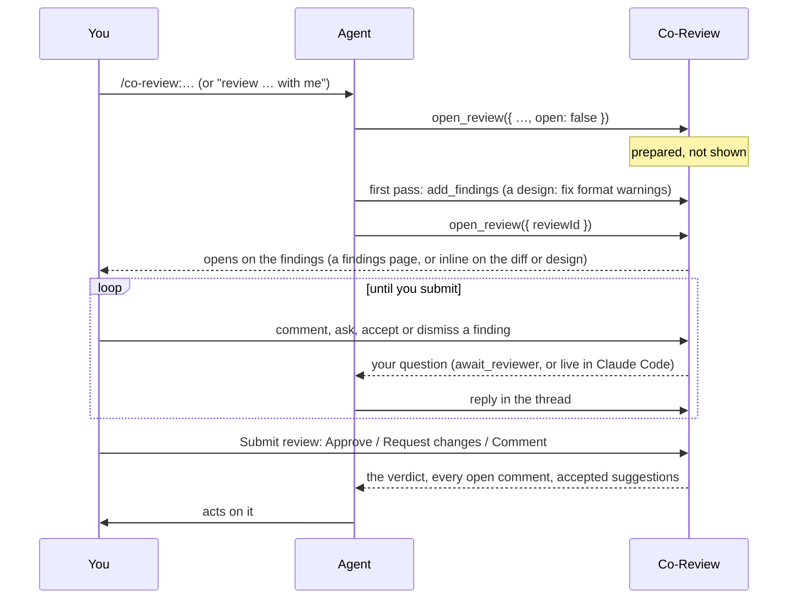

# Review workflows

Co-Review does four review jobs. Pick the one that matches what you want to read, start it with one command, and the
agent does the setup and a first pass before you see anything.

| You want to review | Claude Code | Pi / Oh My Pi | What opens |
|---|---|---|---|
| [The whole repository](#the-whole-repository) | `/co-review:audit [focus]` | `/co-review-audit [focus]` | The repository, on its findings page |
| [Your change](#your-change) | `/co-review:review [base]` | `/co-review-change [base]` | The diff, as a pull-request page |
| [Someone else's pull request](#someone-elses-pull-request) | `/co-review:pr <number>` | `/co-review-pr <number>` | The pull request, with its description |
| [A design, before the code](#a-design-before-the-code) | `/co-review:design <task>` | `/co-review-design <task>` | The design document, rendered |

In any other agent (Codex, Cursor, VS Code, …), ask in plain words, e.g. *"Review this pull request with me in
Co-Review: #42"*; the `co-review` skill (or the Co-Review MCP server's instructions) has the same steps. Setup for
each agent: [Connect your agent](agent-setup.md).

## The shape of every review

1. **Prepared, not shown.** The agent creates the review with `open: false`. You don't see a half-built review, and
   in the desktop app no window appears yet (an agent that connects starts Co-Review in the background).
2. **First pass.** The agent adds findings: the risks and non-obvious decisions it wants you to look at. They arrive
   *proposed*: you accept or dismiss each one.
3. **Shown.** `open_review({ reviewId })` opens the review with the Review panel: a browser tab, or the repository's
   window in the desktop app (focused if it's already open). A repository review opens on its
   [findings page](#the-findings-page); a diff, pull request or design on its own page, with the findings inline. The
   agent tells you what it found.
4. **Questions and answers.** Comment anywhere, or reply to a finding: the agent answers in the same thread. In Claude
   Code with the [live channel](agent-setup.md#live-review-comments-channel), questions reach the session the moment
   you ask; otherwise the agent picks them up from `await_reviewer` (each thread shows whether it has; the agent next to the review's scope in the panel shows whether it is listening; hover it).
5. **One verdict.** **Submit review…** sends the agent your decision, your message and every open comment at once.

### In Co-Review, whatever you review

| To | Do |
|---|---|
| Keep or drop a proposed finding | ✓ **Accept finding** / ⊘ **Dismiss finding** on the thread (the panel's **Proposed** tab lists them) |
| Ask about a finding | Reply in its thread; the agent answers there |
| Comment on code | **+** in the gutter (drag for several lines), or select and press `Cmd+Alt+M` |
| Ask the agent about code | Select it and press `Cmd+Alt+A` (**Ask Agent**) |
| Suggest an edit | In a comment on a patch line or document text, **Suggest a change** |
| Move between threads | `Cmd+Alt+↓` / `Cmd+Alt+↑`, or click a thread in the panel |
| Finish | **Submit review…** in the panel: **Approve**, **Request changes** or **Comment**, with a message |

After you submit, the agent:

| Decision | The agent |
|---|---|
| **Approve** | Goes ahead (commits, merges, continues the plan) and mentions anything still open |
| **Request changes** | Addresses every open comment and applies your accepted suggestions (as new commits for a change; into the document for a design), replies in each thread with what changed, and waits for the next round |
| **Comment** | Answers your comments; changes nothing unless you asked |

The agent doesn't edit files while you review unless you ask for it in a thread.

## The whole repository

For getting a codebase back in your head, checking your own work before a release, or starting on a codebase that
isn't yours. The agent reads it first and splits it into areas, so you start from what matters instead of every file.

**Start:** `/co-review:audit` (optionally a focus: `/co-review:audit security`, `/co-review:audit internal/billing`).

**The agent:**

1. Prepares a review of the repository without showing it.
2. Reads the repository map and the overview, splits the code into 4–10 areas, and reads the riskiest code in each.
   With [Graphify](https://graphify.net) installed, Co-Review builds a code graph first (seconds, no LLM), so the
   overview knows the calls, imports and clusters, and the agent gets Graphify's import cycles and surprising
   connections as leads ([details](agents.md#repository-map)).
3. Adds at most three proposed findings per area, labelled with the area, and says when an area looks fine.
4. Shows the review and tells you the areas and how many findings each has.

**You:** the review opens on the [findings page](#the-findings-page), with the panel on **Proposed**. Read it top to
bottom, follow a finding's link to its code, and accept or dismiss each one in the panel (**By area** groups them the
same way); reply in a finding's thread to ask the agent why. Beyond the findings, **Overview** says where to start (from the Graphify graph when it's installed), **Viewed** (`Cmd+Alt+V`)
marks a file as read, and **Coverage** shows how much of each area you've read. Comment on any line, symbol, file or
folder as you go.

### The findings page

A repository review opens on one page that holds all of it: every finding and comment, grouped by area, each with its
severity, whether it's proposed, open or resolved, a link to the code, the code it's about and the conversation so far.
It's a rendered document, so you read it like a report and comment on it like any page: select text and **Comment**
(or **Ask Agent**). A comment there reaches the agent with the text you selected, so it knows which finding you mean.
The page keeps itself up to date as findings arrive or change; **Findings** in the Review panel (or **Review: Open
Findings**) opens it again.

## Your change

For a change the agent made (or you made together), before it's committed or merged. You read it as a pull request:
only the diff, with line comments, suggested edits and one verdict.

**Start:** `/co-review:review` reviews the uncommitted work. With a base, `/co-review:review main` reviews the branch
against it (`main...HEAD`).

**The agent:**

1. Prepares the review with `open_review({ diff, title, open: false })`. Co-Review runs the `git diff` itself (so no
   output filtering or pager can garble it) and includes new, untracked files for uncommitted work.
2. Adds at most five findings on the changed lines: real risks and decisions you'd want to know about, not a list of
   everything it changed.
3. Shows the review and says, in a sentence, what to look at first.

**You:** the pull-request page lists each file's changes; findings sit on their lines. Comment on a line (or drag for
several), suggest an edit, and submit. With **Request changes**, the agent fixes every comment and applies the accepted
suggestions as new commits (it doesn't rewrite the diff you reviewed), then replies in each thread.

## Someone else's pull request

For a pull request you didn't write: a teammate's, or an outside contribution. The agent takes the first pass; you
decide what goes back to the author.

**Start:** `/co-review:pr 42` (a number or a URL). The agent uses the GitHub CLI (`gh`); without it, it asks you for
the diff.

**The agent:**

1. Reads the pull request (`gh pr view`), fetches its branch, and writes a review directory outside the repository
   with a `PR.md` (title, number, URL, branch, base, commits and the description). The URL is what lets Co-Review
   post your review back to the pull request.
2. Prepares the review with `open_review({ dir, diff: "<base>...<branch>", patchName, title, open: false })`: the diff
   becomes the pull-request page, with the description above it.
3. Reads the changed code in context and adds at most five proposed findings where it matters.
4. Shows the review with a two-sentence summary: what the pull request does and its riskiest part.

**You:** triage the findings, add your own comments, ask the agent about anything ("does this break the old API?"),
and submit. The agent doesn't touch the pull request.

**Post it to GitHub.** When you submit, tick **Also post to GitHub: owner/repo#42**. Co-Review posts your review to
the pull request as one GitHub review, through the GitHub CLI (so `gh auth login` is the only setup):

| In Co-Review | On GitHub |
|---|---|
| Your decision (Approve / Request changes / Comment) | The review's decision (on your own pull request GitHub only allows a comment; Co-Review posts it as one and says so) |
| Your message | The review's summary |
| Open threads on diff lines (your comments, findings you accepted) | Line comments, with the conversation |
| Suggested edits you accepted | GitHub suggestions the author can commit with one click |
| Comments on the pull request or its description | Listed in the summary |
| Proposed findings you didn't accept, resolved threads, the agent's own questions | Not posted |

If a line has left the diff since (the author pushed), its comment goes into the summary instead of failing the post.
The panel then links to the posted review. You can also post later with **⋯ → Post review to GitHub…** (it asks for
the decision and confirms first), or ask the agent to (`post_review_to_github`): Co-Review shows you what goes out and
posts only when you click **Post to GitHub**.

## A design, before the code

For a change worth agreeing on first: a new component, data model, API, async flow or migration. You review the plan
(an L1 · L2 · L3 tree of *what → how → what can go wrong*, with Mermaid diagrams), not the source.

**Start:** `/co-review:design <what to build>`.

**The agent:**

1. Investigates the code and writes `design/<name>/index.markdown` in the [design-document format](design-docs.md).
2. Checks it with `open_review({ dir, open: false })` and fixes every format warning Co-Review reports, so you never
   see a malformed document.
3. Shows it and shares the link.
4. Revises the document from your comments, keeping commented steps' wording stable so your threads stay anchored.
5. Implements only after you approve. If the code has to depart from the design, it updates the design and asks again.

**You:** switch levels with **L1 · L2 · L3**, comment on a step (the icon at its end), a diagram, a node or an edge,
or select text. Open questions are marked `?`, risks `⚠`. **Approve** lets the agent implement; **Request changes**
sends it back to revise.

## Tips

- **Desktop app or browser.** Both work the same. In the desktop app, the window appears when the agent shows the
  review, and closes once you approve it or the agent's session ends (when an agent started the app). In the
  browser, the agent gives you a link.
- **Keep working while you review.** In Claude Code, *"keep answering my review while you fix the tests"* hands the
  review to the background `co-reviewer` subagent.
- **Several reviews.** The switcher at the top of the Review panel lists them; archive the ones you're done with.
- **Away from your desk.** **⋯ → Open mobile view** reads, replies and submits from a phone
  ([over Tailscale](running-and-packaging.md#phone-view)).
- **Without an agent.** Every review can be started by hand from the Review panel (**+**), and **⋯ → Connect agent…**
  brings in an agent for quick questions ([Agents](agents.md)).
