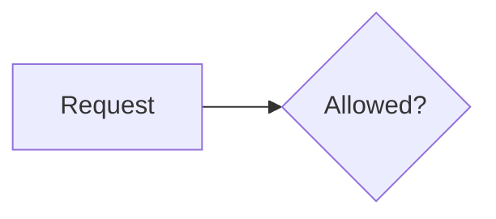

# Design first, reviewed in Co-Review

Put the design in front of the human before the code: they comment on steps, diagram nodes and text in
Co-Review, you answer and revise, and you implement only what they approved.

## 1. Write the document

Create `design/<short-name>/index.markdown` in the repository (or a scratch directory if the user doesn't want
design docs committed):

````markdown
---
co-review: design
---
# <Title>

## Context
Why this change, constraints, what exists today. Short.

## Design
- <L1: what happens, in business language> — <why>
  - <L2: how> — `⚠` <risk>
    - <L3: edge case or error path> — `?` <open question>
- <another L1 step> — `✎` new `<Name>`

## Diagrams


## Open Questions
- <question> — `?` <who decides>
````

Rules (the full spec is Co-Review's `docs/design-docs.md`):

- Sections in this order: Context, Design, Diagrams, Open Questions. Only Design is required.
- `## Design` is **one nested `- ` list**, 2 spaces per level. L1 is business language, L2 is mechanism, and
  L3 is only where it matters. One idea per step. Reasoning goes after ` — `.
- Markers in backticks: `?` open question, `⚠` risk, `✎` new name or artifact.
- Mermaid: `%% id: <name>` on the first line and explicit node ids (`api[CreateOrder]`).
- If the `pseudocode-design` skill is available, use it to write the step tree. Its trees fit this format.

Optionally add the implementation plan as a patch in the same directory (`<name>.patch`, a `git diff`), with a
`PR.md` holding `title:`, `branch:`, `base:` lines, a blank line, then a description.

## 2. Open it

`open_review({ dir: "<absolute path to design/<short-name>>" })`

- If `format.warnings` is non-empty, fix the document and open it again before sharing.
- Give the user the `url`.

## 3. Review loop

Follow the `co-review` skill's loop (`await_comment` → investigate → `reply`), with these additions:

- **Revise the document when a comment changes the design**, then reply saying which step changed.
- **Keep step wording stable.** Comments are anchored to a step's text, so rewording a commented step makes its
  thread outdated. Add a step or append reasoning instead.
- Record decisions under **Open Questions** until they're settled, then move them into the tree.

## 4. After the verdict

`await_review` returns the decision:

- **approve**: implement exactly the approved design. When the code diverges from a step, update the step
  and say so.
- **request-changes**: revise the document, reply per thread, and wait for the next round.
- `acceptedSuggestions` on the document are already written into it by Co-Review (`doc.version` goes up).
  Re-read the file before editing.
